# Cómo funciona este fine-tuning con LoRA

Este documento recorre [`train_lora.py`](../train_lora.py),
[`export_onnx.py`](../export_onnx.py) y [`app.py`](../app.py) paso a paso —
el proyecto más técnico de la serie, con dos problemas reales en el camino
al deploy, no solo uno.

## El panorama general: ¿por qué no reentrenar todo el modelo?

Ajustar un modelo de lenguaje a una tarea o estilo específico normalmente
significaba **fine-tuning completo**: actualizar los ~82 millones de
parámetros de distilgpt2 con backpropagation normal. Eso funciona, pero tiene
un costo que crece con cada tarea nueva: cada fine-tuning completo produce
una copia entera del modelo (cientos de MB), y entrenar todos esos parámetros
consume más memoria y cómputo de los necesarios para un ajuste que, en el
fondo, es pequeño.

**LoRA (Low-Rank Adaptation)** parte de una observación distinta: el cambio
que necesita un modelo para adaptarse a una tarea nueva suele tener **rango
bajo** — se puede describir con muchos menos números de los que tiene la
matriz de pesos original. En vez de actualizar una matriz de pesos `W`
directamente, LoRA la congela y aprende una actualización `ΔW = A·B`, donde
`A` y `B` son matrices mucho más chicas. El modelo usa `W + A·B` en cada
pasada, pero solo `A` y `B` se entrenan.

```mermaid
flowchart LR
    subgraph Entrenamiento["Entrenamiento (train_lora.py, una vez)"]
        P1[distilgpt2\npre-entrenado] --> P2[Congelar todo\ny agregar LoRA] --> P3[Entrenar solo\nA y B] --> P4[Guardar solo\nel adaptador]
    end
    subgraph Exportacion["Exportación (export_onnx.py, una vez)"]
        E1[Fusionar adaptador\nen distilgpt2] --> E2[Exportar a ONNX\ncon optimum] --> E3[Cuantizar a INT8\n330MB -> 82MB]
        P4 -.el adaptador.-> E1
    end
    subgraph Inferencia["Cada consulta (app.py)"]
        I1[Cargar sesión\nONNX Runtime] --> I2[Generar en vivo\ncon LoRA] --> I3[Mostrar junto a un\nejemplo base capturado]
        E3 -.el modelo cuantizado.-> I1
    end
```



---

## Preparación — [`train_lora.py`](../train_lora.py)

### El dataset: estilo, no hechos (líneas 1-60)

A diferencia de un dataset de preguntas y respuestas, acá no hay ningún
"hecho" que el modelo deba aprender — solo un **estilo** (hablar como
pirata). Eso permite generarlo 100% programáticamente
([`make_dataset.py`](../make_dataset.py)): combina plantillas de
saludos, sujetos, verbos náuticos y remates al azar, con semilla fija
(`random.seed(42)`) para que el dataset sea reproducible sin depender de
ninguna descarga externa.

### LoraConfig: dónde y cuánto adaptar (línea 56)

```python
lora_config = LoraConfig(
    r=16,
    lora_alpha=32,
    target_modules=["c_attn", "c_proj"],
    lora_dropout=0.05,
    bias="none",
    task_type="CAUSAL_LM",
)
```

- **`r=16`** es el rango de las matrices `A`/`B` — cuanto más alto, más
  capacidad tiene el adaptador para aprender, pero también más parámetros
  entrenables. 16 es un punto intermedio típico para tareas de estilo.
- **`target_modules`** decide en qué capas se inyecta LoRA. `c_attn` es la
  proyección combinada Q/K/V de la atención de GPT-2; `c_proj` aparece dos
  veces en cada bloque (salida de la atención y salida del MLP) — peft
  encuentra ambas por nombre y les agrega su propio adaptador.
- **`print_trainable_parameters()`** es la prueba concreta de la promesa de
  LoRA: **811.008 parámetros entrenables de 82.723.584 totales — el
  0.98%**. El 99% restante del modelo nunca se toca.

### El loop de entrenamiento (líneas 82-96)

Un bucle manual de PyTorch, sin `Trainer` de Hugging Face — la misma
preferencia por transparencia que ya se vio en el agente tool-use
(proyecto 3): se ve exactamente qué pasa en cada paso (forward, loss,
backward, optimizer.step()) en vez de que una clase lo abstraiga. Con un
dataset de 300 líneas cortas y solo 811K parámetros entrenables, 20 épocas
corren en un par de minutos en CPU — impensable con fine-tuning completo del
modelo entero.

### Guardar solo el adaptador (línea 98)

```python
model.save_pretrained(ADAPTER_DIR)
```

Esto escribe `adapter_config.json` + `adapter_model.safetensors` — **3.2MB
en total**. distilgpt2 completo pesa ~330MB. Esa diferencia (100x más chico)
es la razón práctica por la que el adaptador sí cabe cómodo en un repo de
GitHub normal, sin necesitar Git LFS ni alojarlo aparte.

---

## Exportación — [`export_onnx.py`](../export_onnx.py)

Este script no existía en la primera versión del proyecto — se agregó
después de que el primer deploy a Render se cayera por memoria (ver
troubleshooting más abajo). Hace tres cosas, para **dos** modelos (el
base y el afinado con LoRA, por separado):

```python
merged = PeftModel.from_pretrained(base_model, ADAPTER_DIR).merge_and_unload()
ort_model = ORTModelForCausalLM.from_pretrained(merged_dir, export=True)
quantize_dynamic(onnx_path, quantized_path, weight_type=QuantType.QUInt8)
```

1. **Fusionar** (`merge_and_unload()`): combina `W` y `A·B` en una sola
   matriz de pesos — el resultado es un modelo normal, sin ninguna
   dependencia de `peft` para usarlo.
2. **Exportar** con `optimum`: convierte el modelo (incluyendo el manejo de
   *KV-cache* para generación token por token) a un grafo ONNX ejecutable.
   Esta es la pieza que en un inicio parecía justificar seguir usando
   `torch` en producción — pero `optimum` ya sabe hacer esta conversión,
   no hacía falta escribirla a mano.
3. **Cuantizar** a INT8: cada peso de punto flotante de 32 bits se
   representa con un entero de 8 bits — 4 veces menos espacio, de ~330MB a
   **~82MB** por modelo.

## Inferencia — [`app.py`](../app.py)

```python
session_options = ort.SessionOptions()
session_options.enable_mem_pattern = False
session_options.enable_cpu_mem_arena = False
model = ORTModelForCausalLM.from_pretrained(ONNX_DIR, session_options=session_options)
```

`ORTModelForCausalLM` (de `optimum`) expone la misma interfaz `.generate()`
que un modelo de `transformers` normal — el código que llama a generar
texto no cambió casi nada respecto a la primera versión con `torch` puro,
solo cambió qué clase carga el modelo. Ver el troubleshooting de memoria
más abajo para por qué las dos líneas de `session_options` son necesarias,
y por qué la app compara contra un ejemplo del modelo base ya capturado
en vez de generarlo también en vivo.

---

## Troubleshooting: la primera corrida no mostraba ningún efecto

El primer entrenamiento (4 épocas, tasa de aprendizaje 2e-4, LoRA solo en
`c_attn`) bajó la pérdida de 7.66 a 2.74 — parecía estar aprendiendo — pero
generando después del entrenamiento, **el estilo pirata nunca aparecía**,
ni siquiera pidiéndole al modelo que continuara sin ningún prompt. El
adaptador técnicamente entrenaba, pero su efecto era demasiado débil para
competir con todo lo que distilgpt2 ya "sabía" generar.

**La causa:** con un dataset tan chico y repetitivo (300 líneas con mucha
estructura compartida), pocas épocas a una tasa de aprendizaje conservadora
alcanzan para bajar la pérdida de entrenamiento, pero no para desplazar de
verdad la distribución de salida del modelo en generación libre.

**La solución:** subir agresivamente tanto la capacidad del adaptador como
la intensidad del entrenamiento — `r` de 8 a 16, agregar `c_proj` además de
`c_attn`, tasa de aprendizaje de 2e-4 a 5e-4, y épocas de 4 a 20. La pérdida
bajó hasta 0.23, y esta vez la prueba con prompts fuera del corpus de
entrenamiento (`"The weather today is"`, `"I think that technology"`) sí
generaba continuaciones claramente en estilo pirata. La lección: para un
dataset pequeño y un cambio de estilo notorio, es preferible sobre-ajustar
un poco de más que quedarse corto — a diferencia del fine-tuning completo,
un adaptador LoRA que "memoriza" de más sigue siendo solo 3.2MB para tirar
y reentrenar.

---

## Troubleshooting 2: el deploy en Render se caía por memoria

El primer deploy (con PyTorch + Transformers + peft cargando distilgpt2
directamente, igual que en desarrollo) falló en Render con **"Ran out of
memory (used over 512MB)"** — ni siquiera llegó a abrir el puerto. La causa
no era el tamaño del modelo (distilgpt2 son ~330MB en fp32): midiendo
localmente con `psutil`, el proceso ya pesaba **~550MB de RAM apenas
después de correr un solo forward pass** — antes de generar nada, antes de
Gradio, solo cargar el modelo y ejecutarlo una vez. Ese salto de memoria
(de ~240MB tras los imports a ~550MB tras una sola pasada) viene del propio
runtime de PyTorch en CPU (buffers internos de sus kernels de álgebra
lineal) — es un costo fijo de usar `torch` para inferencia, casi
independiente del tamaño real del modelo.

**Intentos que NO alcanzaron:** fijar `torch.set_num_threads(1)`,
desactivar MKLDNN, forzar hilos únicos por variable de entorno — ninguno
bajó ese salto de ~300MB.

**La solución real:** el mismo patrón que ya resolvió este problema en los
proyectos 1, 2 y 5 — sacar `torch`/`transformers` de producción por
completo:

1. [`export_onnx.py`](../export_onnx.py) fusiona el adaptador LoRA en
   distilgpt2 (`PeftModel.merge_and_unload()`) y exporta el resultado a
   ONNX con `optimum.onnxruntime.ORTModelForCausalLM` — la pieza que
   resuelve lo que antes parecía "demasiado complejo": `optimum` sabe
   exportar generación autoregresiva completa (incluyendo el manejo de
   KV-cache) a un grafo ONNX ejecutable, no hace falta escribirlo a mano.
2. El modelo exportado se cuantiza a INT8 con
   `onnxruntime.quantization.quantize_dynamic` — reduce cada modelo de
   ~330MB a **~82MB**, lo bastante chico para vivir en el repo sin Git LFS.
3. `app.py` corre inferencia con `onnxruntime` + `optimum` únicamente — sin
   `torch` pesado en el camino caliente. Memoria medida en producción:
   **~425MB estable**, sin crecer entre solicitudes repetidas.

Un detalle final: `optimum` depende de `torch` igual (para el manejo de
tensores alrededor de la sesión de ONNX Runtime), así que `torch` sigue
instalado — pero el *cómputo* pesado ya no pasa por sus kernels de CPU,
que era la parte cara. Por eso `render.yaml` instala explícitamente la
rueda de `torch` solo-CPU antes del resto de `requirements.txt`: la rueda
por defecto de PyPI para Linux incluye bibliotecas CUDA que nunca se usan
en este servidor, inflando la imagen y la memoria en reposo sin ningún
beneficio.

### Un ajuste extra: por qué `enable_mem_pattern=False`

Con la configuración por defecto de ONNX Runtime, cargar **dos** sesiones
(una por el modelo base, otra por el fine-tuned) para comparar en vivo
hacía crecer la memoria en cada solicitud — de 560MB a 710MB y subiendo,
sin estabilizarse, porque el *arena allocator* de ONNX Runtime reserva
memoria según la forma de los tensores vistos y no siempre la reutiliza
bien cuando el largo de secuencia cambia entre solicitudes. Desactivar
`enable_mem_pattern` y `enable_cpu_mem_arena` en `SessionOptions` elimina
ese crecimiento (cada solicitud libera su memoria en vez de acumularla) al
costo de un poco de velocidad — y decidimos servir en producción solo el
modelo con LoRA en vivo (el modelo base se muestra con una respuesta real
ya capturada), ya que mantener **dos** sesiones de generación simultáneas
dejaba apenas ~20MB de margen antes del límite de Render.

## ¿Por qué esto no era obvio desde el principio?

A diferencia de un clasificador de imágenes o un detector de objetos
(donde "un forward pass" es toda la inferencia), la generación
autoregresiva de texto tiene un costo de *runtime* de PyTorch mucho más
alto en proporción al tamaño real del modelo — para un modelo de 330MB,
un ~60% de memoria adicional "gratis" del framework es un problema
real. La lección concreta: **medir memoria real con una sola pasada antes
de asumir que "el modelo es chico, va a entrar sin problema"** — el tamaño
del modelo y el costo de correrlo no son lo mismo.

## Cosas para probar, para afianzar la intuición

- **Cambia `target_modules` a solo `["c_attn"]`** (como en el primer
  intento) y deja las 20 épocas — ¿el efecto es más débil incluso con más
  entrenamiento? Eso aísla cuánto aportó agregar `c_proj`.
- **Baja `r` a 4** y vuelve a entrenar — compara cuánto tarda en converger
  la pérdida y qué tan consistente es el estilo pirata generado.
- **Mira `adapter/adapter_config.json`** — ahí queda registrado exactamente
  qué capas y qué rango se usaron, sin necesidad de leer el script de
  entrenamiento.
- **Compara el tamaño de `adapter/` contra el modelo base** (`du -sh
  adapter/` da ~3.2MB; distilgpt2 son ~330MB) — esa razón de 100x es, en una
  sola cifra, todo el argumento de negocio de LoRA.
