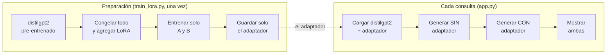

# Cómo funciona este fine-tuning con LoRA

Este documento recorre [`train_lora.py`](../train_lora.py) y [`app.py`](../app.py)
paso a paso. Es el proyecto más técnico de la serie — y el único donde
producción sí necesita las librerías pesadas, algo que vale la pena explicar
antes de entrar al código.

## El panorama general: ¿por qué no reentrenar todo el modelo?

Ajustar un modelo de lenguaje a una tarea o estilo específico normalmente
significaba **fine-tuning completo**: actualizar los ~82 millones de
parámetros de distilgpt2 con backpropagation normal. Eso funciona, pero tiene
un costo que crece con cada tarea nueva: cada fine-tuning completo produce
una copia entera del modelo (cientos de MB), y entrenar todos esos parámetros
consume más memoria y cómputo de los necesarios para un ajuste que, en el
fondo, es pequeño.

**LoRA (Low-Rank Adaptation)** parte de una observación distinta: el cambio
que necesita un modelo para adaptarse a una tarea nueva suele tener **rango
bajo** — se puede describir con muchos menos números de los que tiene la
matriz de pesos original. En vez de actualizar una matriz de pesos `W`
directamente, LoRA la congela y aprende una actualización `ΔW = A·B`, donde
`A` y `B` son matrices mucho más chicas. El modelo usa `W + A·B` en cada
pasada, pero solo `A` y `B` se entrenan.



---

## Preparación — [`train_lora.py`](../train_lora.py)

### El dataset: estilo, no hechos (líneas 1-60)

A diferencia de un dataset de preguntas y respuestas, acá no hay ningún
"hecho" que el modelo deba aprender — solo un **estilo** (hablar como
pirata). Eso permite generarlo 100% programáticamente
([`make_dataset.py`](../make_dataset.py)): combina plantillas de
saludos, sujetos, verbos náuticos y remates al azar, con semilla fija
(`random.seed(42)`) para que el dataset sea reproducible sin depender de
ninguna descarga externa.

### LoraConfig: dónde y cuánto adaptar (línea 56)

```python
lora_config = LoraConfig(
    r=16,
    lora_alpha=32,
    target_modules=["c_attn", "c_proj"],
    lora_dropout=0.05,
    bias="none",
    task_type="CAUSAL_LM",
)
```

- **`r=16`** es el rango de las matrices `A`/`B` — cuanto más alto, más
  capacidad tiene el adaptador para aprender, pero también más parámetros
  entrenables. 16 es un punto intermedio típico para tareas de estilo.
- **`target_modules`** decide en qué capas se inyecta LoRA. `c_attn` es la
  proyección combinada Q/K/V de la atención de GPT-2; `c_proj` aparece dos
  veces en cada bloque (salida de la atención y salida del MLP) — peft
  encuentra ambas por nombre y les agrega su propio adaptador.
- **`print_trainable_parameters()`** es la prueba concreta de la promesa de
  LoRA: **811.008 parámetros entrenables de 82.723.584 totales — el
  0.98%**. El 99% restante del modelo nunca se toca.

### El loop de entrenamiento (líneas 82-96)

Un bucle manual de PyTorch, sin `Trainer` de Hugging Face — la misma
preferencia por transparencia que ya se vio en el agente tool-use
(proyecto 3): se ve exactamente qué pasa en cada paso (forward, loss,
backward, optimizer.step()) en vez de que una clase lo abstraiga. Con un
dataset de 300 líneas cortas y solo 811K parámetros entrenables, 20 épocas
corren en un par de minutos en CPU — impensable con fine-tuning completo del
modelo entero.

### Guardar solo el adaptador (línea 98)

```python
model.save_pretrained(ADAPTER_DIR)
```

Esto escribe `adapter_config.json` + `adapter_model.safetensors` — **3.2MB
en total**. distilgpt2 completo pesa ~330MB. Esa diferencia (100x más chico)
es la razón práctica por la que el adaptador sí cabe cómodo en un repo de
GitHub normal, sin necesitar Git LFS ni alojarlo aparte.

---

## Inferencia — [`app.py`](../app.py)

### Comparar con y sin adaptador, sin duplicar el modelo (línea 21)

```python
model = PeftModel.from_pretrained(base_model, ADAPTER_DIR)
...
with model.disable_adapter():
    output_ids = model.generate(...)
```

`PeftModel` envuelve `base_model` **por referencia**, no por copia. El
context manager `disable_adapter()` desactiva temporalmente las matrices LoRA
durante esa llamada — así una sola instancia del modelo en memoria sirve
para generar tanto la versión "base" como la versión "con LoRA", sin
necesitar cargar distilgpt2 dos veces.

### Reproducibilidad de la comparación (línea 48)

```python
torch.manual_seed(0)
base_text = generate(..., use_adapter=False)
torch.manual_seed(0)
lora_text = generate(..., use_adapter=True)
```

Fijar la misma semilla antes de cada llamada hace que ambas generaciones
partan del mismo muestreo aleatorio subyacente — así la diferencia entre
las dos respuestas se debe **solo** al adaptador, no a que el sampling
haya tomado caminos distintos por azar.

---

## Troubleshooting: la primera corrida no mostraba ningún efecto

El primer entrenamiento (4 épocas, tasa de aprendizaje 2e-4, LoRA solo en
`c_attn`) bajó la pérdida de 7.66 a 2.74 — parecía estar aprendiendo — pero
generando después del entrenamiento, **el estilo pirata nunca aparecía**,
ni siquiera pidiéndole al modelo que continuara sin ningún prompt. El
adaptador técnicamente entrenaba, pero su efecto era demasiado débil para
competir con todo lo que distilgpt2 ya "sabía" generar.

**La causa:** con un dataset tan chico y repetitivo (300 líneas con mucha
estructura compartida), pocas épocas a una tasa de aprendizaje conservadora
alcanzan para bajar la pérdida de entrenamiento, pero no para desplazar de
verdad la distribución de salida del modelo en generación libre.

**La solución:** subir agresivamente tanto la capacidad del adaptador como
la intensidad del entrenamiento — `r` de 8 a 16, agregar `c_proj` además de
`c_attn`, tasa de aprendizaje de 2e-4 a 5e-4, y épocas de 4 a 20. La pérdida
bajó hasta 0.23, y esta vez la prueba con prompts fuera del corpus de
entrenamiento (`"The weather today is"`, `"I think that technology"`) sí
generaba continuaciones claramente en estilo pirata. La lección: para un
dataset pequeño y un cambio de estilo notorio, es preferible sobre-ajustar
un poco de más que quedarse corto — a diferencia del fine-tuning completo,
un adaptador LoRA que "memoriza" de más sigue siendo solo 3.2MB para tirar
y reentrenar.

---

## ¿Por qué este proyecto sí necesita torch/transformers en producción?

Los proyectos 1, 2 y 5 evitaron PyTorch en producción exportando a ONNX
(FastEmbed, MobileNetV2, YOLOv8n). Acá no se hizo lo mismo, a propósito:
generar texto token por token con manejo de *attention cache* (KV-cache) es
mucho más complejo de exportar y ejecutar fuera de `transformers` que una
sola pasada de clasificación o detección — existen herramientas (`optimum`,
ONNX Runtime GenAI) para hacerlo, pero agregan una capa de complejidad que
no se justifica para un proyecto de aprendizaje enfocado en LoRA, no en
optimización de inferencia. Es un contraste útil con los proyectos
anteriores: **no todas las cargas pesadas se pueden aligerar igual de
fácil** — la generación autoregresiva es genuinamente más difícil de hacer
liviana que clasificar o detectar.

## Cosas para probar, para afianzar la intuición

- **Cambia `target_modules` a solo `["c_attn"]`** (como en el primer
  intento) y deja las 20 épocas — ¿el efecto es más débil incluso con más
  entrenamiento? Eso aísla cuánto aportó agregar `c_proj`.
- **Baja `r` a 4** y vuelve a entrenar — compara cuánto tarda en converger
  la pérdida y qué tan consistente es el estilo pirata generado.
- **Mira `adapter/adapter_config.json`** — ahí queda registrado exactamente
  qué capas y qué rango se usaron, sin necesidad de leer el script de
  entrenamiento.
- **Compara el tamaño de `adapter/` contra el modelo base** (`du -sh
  adapter/` da ~3.2MB; distilgpt2 son ~330MB) — esa razón de 100x es, en una
  sola cifra, todo el argumento de negocio de LoRA.
